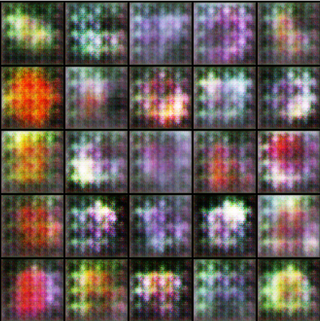
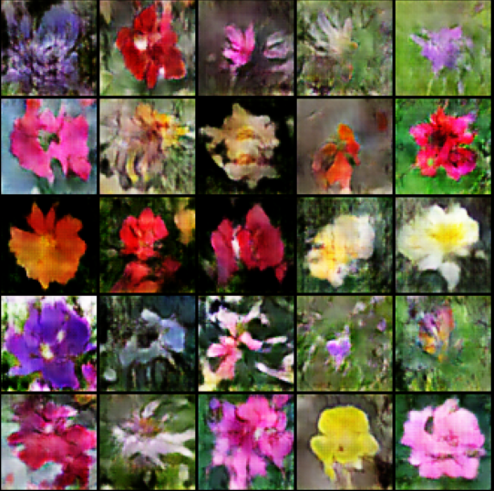
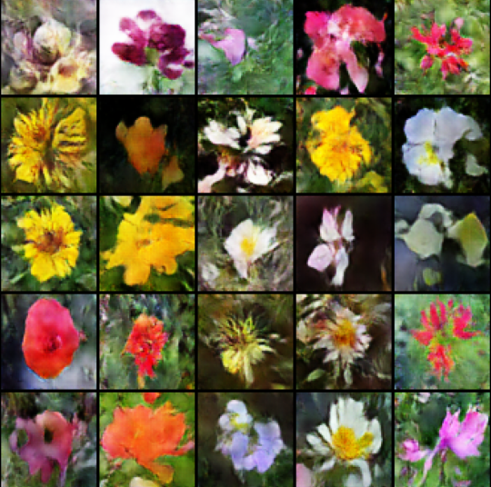

# Generating Flowers - Using Spectrally Normalized GAN

This repository contains the Spectrally Normalized (SN) GAN architecture, model weights and training resuls. SN-GAN is based on the paper [Spectral Normalization for Generative Adversarial Networks](https://arxiv.org/abs/1802.05957).

# Architecture Details

**SN-GAN** uses spectral normalization, which is a weight normalization technique, to stabilize the training of **Discriminator**. The spectral norm of a weight matrix **W** can be obtained by **Singular Value Decomposition (SVD)**, which helps finding the matrix's largest singular value.

Once the largest singular value is obtained, it is divided by every value in the weight matrix. 

- In pytorch, we use ```torch.nn.utils.spectral_norm``` which is wrapped around each ``nn.Conv2d`` layer

Unlike batch norm, which is used to normalize the activations of each layer, spectral norm normalizes the weights of each layer.

# Dataset

I have used **Flowers102** (Oxford 102 Flower) dataset. It is available by calling ```torchvision.datasets.Flowers102```. It consists of 102 flower categories. The flowers were chosen to be flowers commonly occurring in the United Kingdom. I have resized the images to **64 x 64** for faster training.

# Results

Below are some generated flowers after 20, 120 and 200 epochs of training respectively:

<br>

### **20 epochs**
<br>



<br>

### **120 epochs**
<br>



<br>

### **200 epochs**
<br>



<br>

### Feel free to load the model weights and generate some flowers ;)